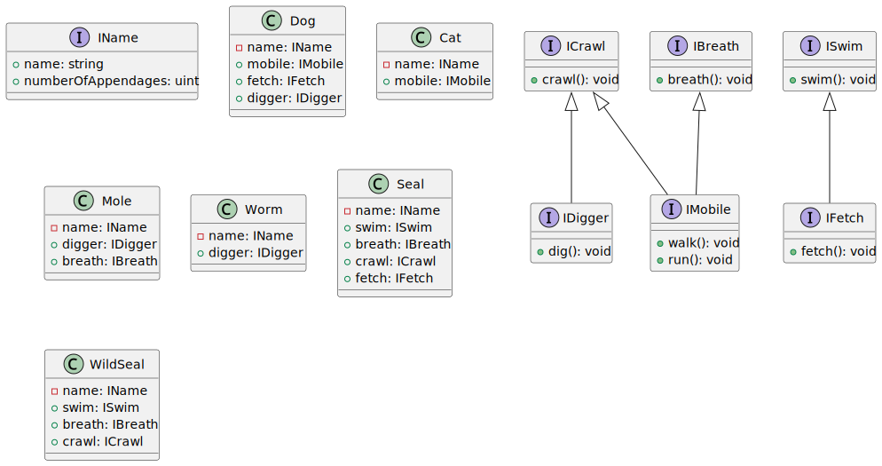

# The Failures Of Inheritance

## Introduction

Inheritance provides a heirarchical structure and is designed to model the real world. The commonly used example is "Animals" so we will use this as a quick explanation

In this UML class diagram we can see that Dog, Cat and Worm all inherit from Animal. This includes states and behaviours.

## Downsides

The above example quickly starts to fall down however as our assumptions on how our code should be structured is challenged when actually implementing the code.

In the above example principally Worms, Dogs and Cats have is-a relationships to Animals which is a common way of thinking of class hierarchy.

It is when we come to the attributes (have-a) and behaviours of class structures where refactoring needs to take place in order to keep to the S, O and I (Single Responsiblity, Open to Extension Closed for Modificiation and Interface Segregation Principle) principles in SOLID.

### SOLID Violation Example

Taking the first example a design assumption could be made by a developer that most animals will have similar attributes and behaviours. This means our sub-types will adopt these attributes and behaviours (extension).

All fine so far. Dogs and Cats have a name, legs can walk, run and crawl.

Lets make it interesting and lazily extend the behaviours of Animal and see how well this model keeps working.

From this we can easily note some violations of I in SOLID. A wild seal or cat won't play fetch, cat's also refuse to swim and lastly for one final example A worm can't breath it passively absorbs oxygen through spiricles.

The S is also violated as Animal is now responsible for all the concepts of animal subtypes (code smell of large class (a bloater)).

This model has now broken down and requires refactoring due to violating S and I of SOLID. The O of SOLID is also proving difficult to maintain when new sub-classes challenge the original class hierarchy.

### Refactor

Lets refactor this (remember that C# doesn't support multi-inheritance)...

Have a go!

Not all animals walk, run, dig, crawl, swim, play fetch or even breath

Here's one possible solution

As demonstrated this is a tough one to refactor whilst keeping the same class hierarchy. This refactor can be taken further but it increasingly abstracts the problem.

### A Better Way

For example a class containing walk and run could be used for Dog and Cat but then you would need a second class for crawl which couldn't be reused for Dog and Cat (multi-inheritance) but could for Seal and Mole.

For this we can use interfaces and get closer to our end goal of modelling animals. However our code would still be wet.

Whilst this may look more chaotic it is clear that this approach has increased flexiblity and less abstraction allowing for better focus on the coding problem at hand.

For example should a animal that can't swim but can fetch be added to the model we would simply change IFetcher to stop inheriting from ISwimmer and change both Dog and Seal to use both IFetcher and ISwimmer. However this is still reliant on "perfect design" that comes with inheritance.

### Analysis Of Inheritance

The behaviour of fetch could not take advantage of class hierarchy for example as either all swimming animals would have to be able to play fetch... which wild seals can't or all fetching animals would have to be able to swim.

The other problem here is base classes need to become more abstract in how they name attributes in order to cover seal flippers and dog legs. So in this case legs became appendages being a catch all term but this does not model the inividual animal accurately.

In the end the class heirarchy comes down to name and appendages being shared with every single behaviour set being unique to each animal in order not to violate SOLID.

This is where inheritance starts to fail as a concept as we are now thinking more about cases that challenged our original design assumptions than the problem we are trying to solve writing code in the first place...

## Alternative

So what we have above is a conveluted mess. The focus on abstraction has taken precidence over trying to solve the code problem. Lets pull from existing wisdom to solve this.

### Composition

In the lense of what we are looking at here composition would define common behaviours as interfaces. C# supports mutiple interface inheritance.

In this example here we can simply add and remove the functionality that each animal has with its respective components. Each component can have many concrete implementations or default implementations that can be subsititued into each class providing maximum re-use and flexibility to the design.

## Summary

In composing our models we get closer to the real world and can spend more time on the problem and less time on refactoring abstraction.
